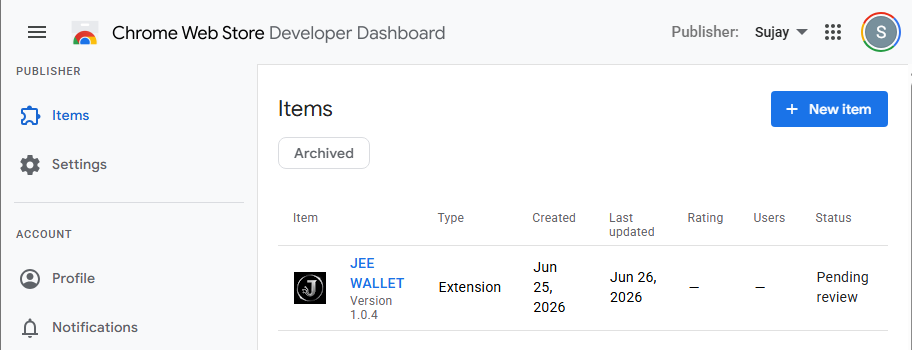
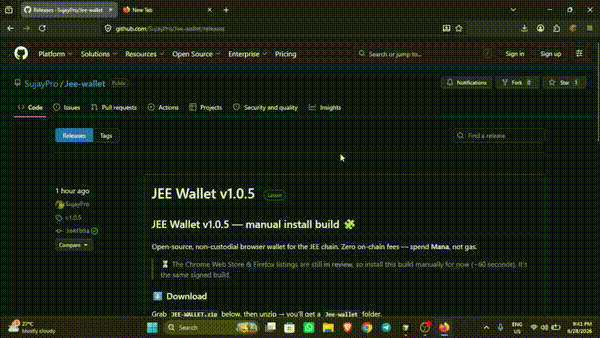

<!--
  This is the README that ships INSIDE JEE-WALLET.zip (rename to README.md
  at the root of the Jee-wallet folder). It walks users through installing
  the unpacked extension on Chrome / Brave and Firefox while the store
  listings are pending review.
-->

<!-- Animated waving header (renders as a live animated SVG on GitHub) -->

<!-- Animated typing subtitle -->

 

**[🌐 Website](https://jee.money)** · **[🧩 Wallet](https://jee.money/wallet)** · **[🔍 Explorer](https://jeescan.org)** · **[💻 Source](https://github.com/SujayPro/Add-Wallet)**

 

<!-- One-click direct download of the latest release asset named JEE-WALLET.zip -->

---

## 🔓 100% Open Source

JEE Wallet is **fully open source** under the **Apache-2.0** license. Nothing is hidden:

- 🔐 **Non-custodial** — your seed phrase and private keys are generated and encrypted **only on your device**. We never see them.
- 🧾 **Auditable** — read every line, build it yourself, verify the signatures.
- 🚫 **No custodial backend** — there is no server holding your funds.
- 🕵️ **Zero telemetry** — the wallet collects nothing.

> 👉 Source code: **https://github.com/SujayPro/Add-Wallet** — star it, fork it, audit it.

---

## ⏳ Why a manual install?

The official store listings are **in review** (Chrome ≈ 4 weeks). Until they're live, you install the wallet **manually from this folder** — it takes about **60 seconds**. It's the exact same signed build.

☝️ Live status on the Chrome Web Store Developer Dashboard — <b>JEE WALLET v1.0.4 · Pending review</b>.

---

## ⬇️ Step 1 — Download & unzip (do this first)

1. **[⬇️ Click here to download `JEE-WALLET.zip`](https://github.com/SujayPro/Add-Wallet/releases/latest/download/JEE-WALLET.zip)** — one click, starts instantly (always the latest version).
2. **Right-click → Extract All** (don't run it from inside the zip).
3. You now have a folder named **`Jee-wallet`**. Remember where it is — you'll point your browser at it in a second. 📁

---

## 🧩 Install on Chrome & Brave

> Works the same on Chrome, Brave, and Edge (they all share this Chromium build).

<!-- Auto-playing, looping GIF (renders inline on GitHub like any image). -->

▶️ sped-up demo (loops) · <a href="https://github.com/SujayPro/Add-Wallet/raw/main/docs/chromium.mp4">full-speed video</a>

| # | Do this | Where |
|---|---------|-------|
| 1️⃣ | Open the extensions page | Type `chrome://extensions` in the address bar &nbsp;·&nbsp; Brave: `brave://extensions` &nbsp;·&nbsp; Edge: `edge://extensions` |
| 2️⃣ | Turn on **Developer mode** | Toggle in the **top-right** corner |
| 3️⃣ | Click **Load unpacked** | Button appears top-left |
| 4️⃣ | Select the **`Jee-wallet`** folder | The extracted folder (the one that contains `manifest.json`) |
| 5️⃣ | Pin it 📌 | Click the puzzle icon → pin **JEE Wallet** to your toolbar |

✅ **Done!** Click the JEE Wallet icon to create or import your wallet.

🔄 Updating later

When a new version drops: download the new `JEE-WALLET.zip`, replace the old folder, then hit **Refresh ⟳** on the JEE Wallet card in `chrome://extensions`.

---

## 🦊 Install on Firefox

> Requires **Firefox 128 or newer**.

<!-- Auto-playing, looping GIF (renders inline on GitHub like any image). -->

▶️ sped-up demo (loops) · <a href="https://github.com/SujayPro/Add-Wallet/raw/main/docs/foxy.mp4">full-speed video</a>

| # | Do this | Where |
|---|---------|-------|
| 1️⃣ | Open the debugging page | Type `about:debugging#/runtime/this-firefox` in the address bar |
| 2️⃣ | Click **Load Temporary Add-on…** | Button on the right |
| 3️⃣ | Open the **`Jee-wallet`** folder | The one you extracted in Step 1 |
| 4️⃣ | Select the **`manifest.json`** file | Pick the `manifest.json` **inside** that folder, then **Open** |
| 5️⃣ | Use it | JEE Wallet appears in the toolbar · sidebar via **View → Sidebar → JEE Wallet** |

✅ **Done!**

> ⚠️ **Heads-up:** Firefox clears *temporary* add-ons every time you **restart** the browser. Just repeat the steps above (`about:debugging` → Load Temporary Add-on → `manifest.json`) after a restart.

---

## 🛟 Troubleshooting

| Problem | Fix |
|--------|-----|
| ⬜ Blank / white popup | You selected the wrong folder. Choose the folder that **directly contains `manifest.json`**. |
| ⚠️ Chrome warns about "developer mode extensions" | Harmless — just close the notice. It appears because the store version isn't live yet. |
| 🦊 Add-on vanished in Firefox | Temporary add-ons reset on restart — reload it via `about:debugging`. |
| 🔌 dApp won't connect (Firefox) | Make sure you're on **Firefox 128+**. |

---

## ⛓️ Chain quick facts

| | |
|---|---|
| **Network** | JEE Mainnet (live) |
| **Fees** | **Zero** — spend **Mana**, not gas |
| **Custody** | Non-custodial (keys stay on your device) |
| **Explorer** | [jeescan.org](https://jeescan.org) |

---

**If JEE Wallet helps you — ⭐ the repo: [github.com/SujayPro/Add-Wallet](https://github.com/SujayPro/Add-Wallet)**

_Built for JEE · Built for the open web · Zero fees on-chain_

